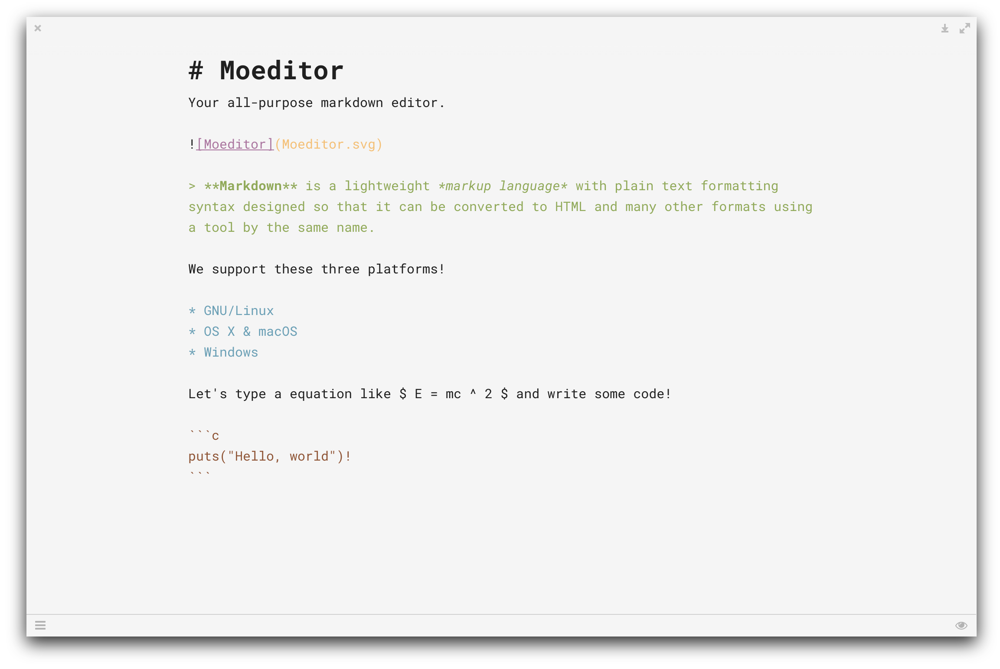

# Moeditor
Your all-purpose markdown editor.

Built with Electron.

Visit our [homepage](https://moeditor.github.io/) or download [releases](https://github.com/Moeditor/Moeditor/releases).

# Screenshot




# Building
```bash
npm install
npm start
```

In China, you may want to replace npm with cnpm for a faster download speed.

```bash
npm install cnpm -g --registry=https://registry.npm.taobao.org
cnpm install
cnpm start
```

# Todo
* Preference settings dialog
* Custom themes
* Spell check
* Better UI/UX
* \* Document manager
* \* Web publisher
