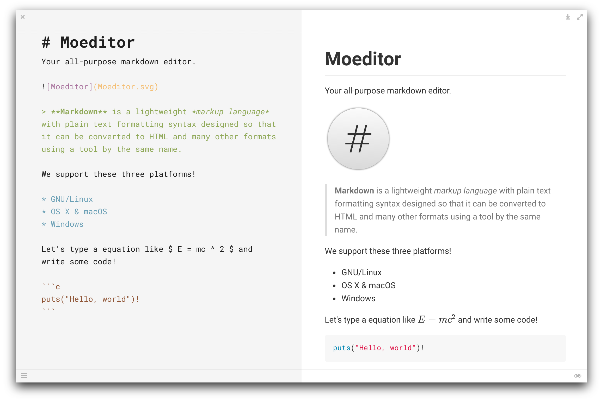
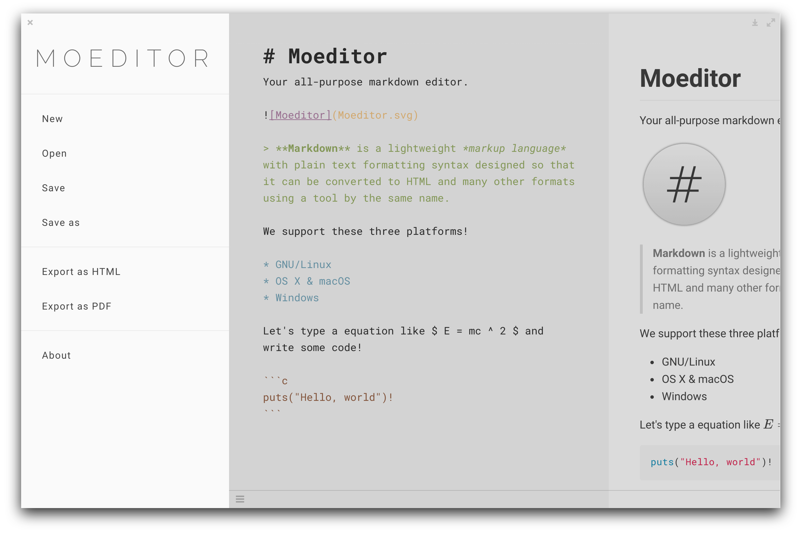
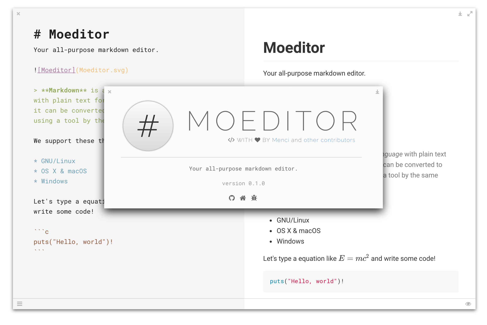
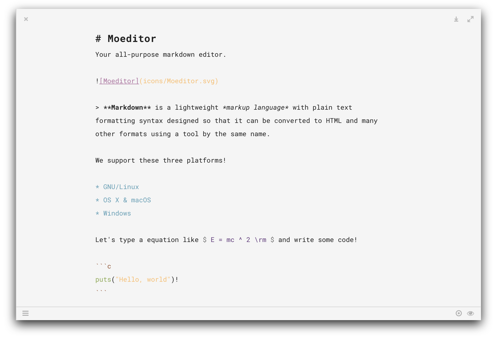

# If you are a developer, please read [The future of Moeditor](https://github.com/Moeditor/Moeditor/issues/153)
# If you are a developer, please read [The future of Moeditor](https://github.com/Moeditor/Moeditor/issues/153)

# Moeditor
Your all-purpose markdown editor.

Built with Electron.

Visit our [homepage](https://moeditor.org/) or download [releases](https://github.com/Moeditor/Moeditor/releases).

# Features
* GitHub Flavored Markdown
* TeX math expressions
* UML diagrams
* Code highlight in editor
* Read/Write/Preview mode
* Custom font / line height / font size
* Code highlight themes (powered by [highlight.js](https://highlightjs.org/))
* Auto reload
* Localization
* Focus mode

# Screenshots








# Building
```bash
npm install
npm start
```

In China, you may want to replace npm with cnpm for a faster download speed.

```bash
npm install cnpm -g --registry=https://registry.npm.taobao.org
cnpm install
cnpm start
```

# Debugging
There's three ways to open the [Chromium Developer Tools](https://developer.chrome.com/devtools).

* Add `--debug` to the command line args:
```bash
npm start -- --debug
```

* Set `debug` to `true` in the config. The config file is stored in `~/.config/configstore/Moeditor.json` (for every system).

* `Ctrl` + `Shift` + `I` in Linux / Windows or `Command` + `Option` + `I` in OS X / macOS to toggle devtools for a window.

# Todo
* [ ] Custom themes
* [ ] Spell check
* [ ] UI/UX

# Localization
Moeditor will auto detect your system language and use the localization.

You can set language manually in the Settings window.

Now the app supports English, Chinese, French, German, Spanish and *incomplete* Portuguese.

**Help us** if you can translate this app. Please follow the guide in `app/moe-l10n.js`.

# License
Moeditor itself is licensed under the **GPL v3** license.

Some node modules are licensed under other free software license.

The `Raleway` font is licensed under the OFL open font license.

# Credits
The domain `moeditor.org` is sponsored by [Showfom](https://ttt.tt/).

# Known Bug(s)
Issue #31.
